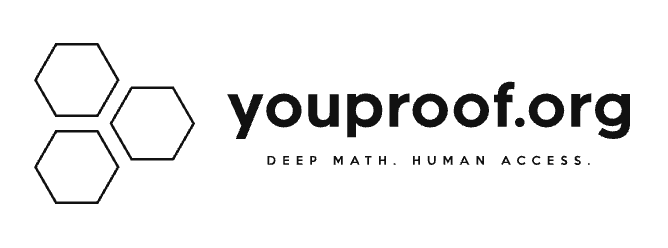
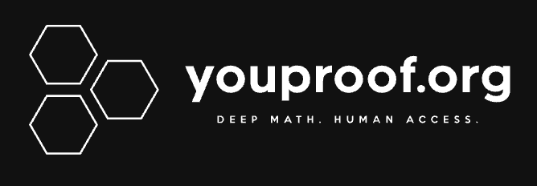

# YouProof.org — Finalize Design Plan

Implementation plan for Claude Code covering the remaining design work to bring
`youproof.org` out of staging: new branding, the homepage, series (book) and
article pages, the content model changes needed to support them, and the
legacy-site redirects/stubs tying it all back to `youproof.hu`.

This is a **sketch**. Sections are ordered to match the source mindmap.
Sections marked `(TBD)` still need detail before Claude Code should start
implementation; the Homepage design section is final and detailed enough to
build from.

---

## 0. Context for Claude Code

- Repos: `youproof-org/services` (pnpm monorepo, Next.js static build,
  Cloudflare Worker, Terraform), `youproof-org/content` (YAML content files),
  `youproof-org/editor` (VS Code extension).
- Architecture: fully static/serverless. Next.js generates HTML at build
  time from YAML content, output uploaded to R2, Cloudflare Worker/CDN
  serves it. No Node runtime in production.
- Legacy site: WordPress, `youproof.hu` (production) /
  `staging.youproof.hu` (staging), currently proxied transparently by the
  migration Worker for unmigrated content.
- Legacy redirect mechanism already exists in the Worker (301 redirect for
  migrated content vs. proxy-through for unmigrated content, guarded by
  `X-Legacy-Guard`). All "redirect from legacy" items below reuse this
  mechanism — Claude Code should already be familiar with it from prior
  work; **do not re-design it**, just extend its routing table/config.
- Content model today: `chapter.yaml` files support a `published` flag and
  a `legacy-path` field. Per §4.1, `published` is being replaced with
  `published-at` across **all** content types (not just `article`), so
  `chapter.yaml` is in scope for that migration too, alongside the new
  `book`, `article`, `newsletter`, `page`, and `landing` types.

---

## 1. New logo / favicon

- Design a new logo and favicon for `youproof.org`.
- Direction settled on: three outlined hexagons in a triangular cluster
  (mark) + `youproof.org` wordmark (bold, lowercase, tight tracking) +
  small uppercase tagline `DEEP MATH. HUMAN ACCESS.` underneath. Two
  layout variants — horizontal (mark left of wordmark) and stacked (mark
  above wordmark) — each needed in both black-on-white and
  white-on-black.

  | Horizontal, light | Horizontal, dark |
  |---|---|
  |  |  |

  | Stacked, light | Stacked, dark |
  |---|---|
  |  |  |

  Source PNGs are alongside this document under `logo-assets/`. These are
  sketches, not final production assets (favicon crop, SVG source, and
  exact hex sizing/stroke-width still TBD) — treat them as the agreed
  visual direction for Claude Code to build the real assets from, or wait
  for finalized files to be uploaded directly to the repo.
- Horizontal layout is the natural fit for the homepage header mark
  (§2.1); stacked layout is the natural fit for the homepage hero mark.
  Favicon should be derived from the hexagon cluster alone (no wordmark).

---

## 2. Homepage

### 2.1 Design — FINAL, detailed below

Served at `https://youproof.org/`. Fully responsive, compact/minimal.

**Layout, top to bottom:**

1. **Header** — horizontal branding lockup on the left: logo mark +
   "youproof.org" wordmark side by side, with the primary motto
   **"Deep math. Human access."** below it in small type (a compact
   strapline under the lockup, not a headline — think of it as the
   "youproof.org" + "DEEP MATH. HUMAN ACCESS." pairing from the reference
   ad design, scaled down to header size). Primary nav
   (`Cikkek`, `Könyvek`, `Hírek`) · search icon (right), same row as the
   branding block. On mobile, nav collapses behind a hamburger icon;
   search icon stays visible; branding block stays but the strapline can
   drop if space is tight.
2. **Hero** — vertical/stacked branding lockup, centered: logo mark above
   the "youproof.org" wordmark. Below that, the secondary tagline
   **"There is no royal road, just better maps…"**, sized noticeably
   larger than before — no longer a small muted caption, more like a real
   supporting headline (still clearly secondary to the header's motto in
   weight/hierarchy, but readable at a glance). The primary motto is
   *not* repeated here — it already lives in the header.
   - **Background art (concept only, not built yet):** a subtle full-hero
     background image — a "map"-like technical/topographic sketch:
     contour lines plus a constellation of connected nodes, with
     mathematical notation fragments floating in it (e.g. `∀x∈X, P(x)`,
     `∃!y∈Y`, `∴ Q.E.D.`, `→ Lemma`) and a single glowing/highlighted
     path winding through the terrain from one node to another — evoking
     "there is no royal road, just better maps." A reference mood image
     exists (`logo-assets/ad-design.png`, dark background / white
     linework, made earlier for an ad):

     

     For the homepage hero it should be **color-flipped**: black linework/nodes on a white/light background,
     kept subtle enough to sit behind the branding and tagline without
     hurting text legibility (low contrast, likely very light gray
     rather than pure black, and/or faded toward the hero's edges).
     Treat this as a backlog item — Claude Code should leave a
     placeholder/no background for now rather than generate this art
     itself.
3. **Könyvek (series/book) section** — section label + "Összes" link. Grid
   of series cards (3 columns desktop), each with thumbnail, title, and a
   meta line (topic · chapter count). On mobile: horizontal scroll instead
   of a grid. Labeled "Könyvek" ("Books") rather than "Sorozatok"
   ("Series") deliberately — these are, or will soon be, real printed
   books, and the wording should carry that across both the online and
   offline reading experience.
4. *(generous spacing / visual separator before next section)*
5. **Legutóbbi cikkek (articles) section** — section label + "Összes"
   link. Articles as **full-width horizontal boxes** (small square
   thumbnail on the left, title + short excerpt on the right), stacked
   one per row. This is the section where standalone articles
   (`/articles/{slug}`) are listed.
6. *(generous spacing / visual separator before next section)*
7. **Hírek (newsletter) section** — section label. Simple date + title
   list. This is where `newsletter` items (`/newsletter/{slug}`) are
   listed.
8. **Footer** — legal/custom page links (`Impresszum`, `Adatkezelés`,
   `Jogi nyilatkozat`, `Süti`, plus any other published `page` items) ·
   copyright line.

**Visual language:** black/white-first, neutral surface tones, thin
1px borders, generous whitespace, no drop shadows, system sans-serif
font stack, small type scale (header motto ~13–15px, hero tagline
~18–22px, body ~13–14px).

A working HTML/CSS sketch of this layout (desktop + mobile breakpoint at
640px) already exists: `youproof-homepage-sketch.html` (attached
separately). Use it as the structural/CSS reference when implementing the
real Next.js components; colors and the logo placeholder in it are
temporary and should be swapped for final brand assets from item 1.

### 2.2 Redirect from legacy site

- `https://youproof.hu` (root) → 301 redirect to `https://youproof.org`.
- Same redirection mechanism as existing content redirects (see §0).

---

## 3. Book (series) index page

### 3.1 Design

- Series index page served at `https://youproof.org/books/{slug}`.
- Chapters served at `https://youproof.org/books/{book-slug}/chapters/{chapter-slug}`.
- Visual language follows the homepage (§2.1): same black/white-first
  palette, thin borders, generous whitespace, same type scale and card
  conventions. Content structure follows the legacy page
  (`https://youproof.hu/kriptografia/`), reorganized into these sections
  top to bottom:
  1. **Headline** — title block laid out like the horizontal logo lockup:
     book-specific icon/mark + "Episode I"-style episode label + the book
     title ("Alice és Bob") below it. (Legacy precedent: the
     `logo_only_cryptography` icon + "Episode I" + "Alice és Bob".)
  2. **Questions box** — a bordered box containing a short bulleted list
     of "mind-opening" questions about the book's subject matter (legacy
     precedent: "Az email-jeid vajon titokban maradnak?" etc.), meant to
     hook the reader before the abstract.
  3. **Kivonat (abstract)** — a short prose section, a few sentences,
     summarizing what the book covers (legacy precedent: the
     "Az írásbeliség megjelenése óta…" paragraph, though legacy doesn't
     label it explicitly — new design should have an explicit "Kivonat"
     heading).
  4. **Tartalom (table of contents)** — chapters listed as **full-width
     boxes**, the same visual pattern as the homepage's article boxes
     (§2.1: small thumbnail left, title + short excerpt right), but
     **grouped by part** — see `part.yaml` for how chapters are grouped
     into parts; Claude Code should look at the existing `part.yaml`
     structure/content for the grouping model rather than this doc
     re-deriving it. Each part likely needs its own sub-heading above its
     group of chapter boxes.
  5. **Felhasznált irodalom (references)** — list of references used in
     the book (legacy precedent: the numbered bibliography list at the
     bottom of the kriptográfia page).
  - No pagination needed at this stage (§6 open question resolved — see
    below); a book's full chapter list renders on one page regardless of
    length.

### 3.2 Redirect from legacy site

- `book.yaml` should support the same `published-at` datetime field and
  `legacy-path` field that `chapter.yaml` supports (see §4.1 for the
  `published` → `published-at` migration, which applies to `book` too).
- Legacy series index URLs (e.g. `https://youproof.hu/kriptografia`)
  redirect to the new series index page (e.g.
  `https://youproof.org/books/alice-es-bob`), using the same redirect
  mechanism as §0/§2.2.

---

## 4. Individual articles

### 4.1 Content model changes

- New content object type: `article`. Same structure as `chapter`, except
  an `article` does **not** belong to any book/series.
- Replace the boolean `published` flag with a `published-at` datetime
  field, **across all content types** — `chapter`, `book`, `article`,
  `newsletter`, `page`, and `landing` — for consistency, not just
  `article`.
  - Absence of `published-at` ⇒ treated as unpublished (`published=false`
    equivalent).
  - Presence of `published-at` ⇒ published, and the datetime is used to
    order items (most recent first) wherever a given type is listed
    (e.g. articles and newsletter items on the homepage).
- Articles are listed in the homepage "Legutóbbi cikkek" section (§2.1),
  ordered by `published-at` descending.
- Served at `https://youproof.org/articles/{slug}`.

### 4.2 Not-found stub / redirect from legacy

- Unmigrated articles get the standard not-found stub page, linking back
  to their legacy counterpart (existing stub pattern — Claude Code already
  knows this).
- Legacy article URLs redirect (same mechanism as §0) to the new article
  page once migrated.

---

## 5. "Migration in progress" notification (legacy site)

- Add a notification header/banner to the **legacy** site, deployed at
  `legacy.staging.youproof.hu` and `legacy.youproof.hu`.
- Source lives in the old `dkuratowski/youproof` repository (separate from
  the `youproof-org/*` monorepo).
- **Claude Code should ask for access to this repository before starting
  this item** — it is not currently part of the accessible workspace.

---

## 6. Newsletter pages

- New content object type: `newsletter`. Same structure as `article`.
- Listed in the homepage "Hírek" section (§2.1), same
  most-recent-first ordering behavior as articles (via `published-at`).
- Served at `https://youproof.org/newsletter/{slug}`.

---

## 7. Custom pages

### 7.1 Content model changes

- New content object type: `page`. Same structure as `article`.
- Linkable from the homepage footer (§2.1) and from any other page.
- Served at `https://youproof.org/{slug}`.

### 7.2 Not-found stub / redirect from legacy

- Unmigrated pages get the standard not-found stub, linking to the legacy
  counterpart.
- Legacy page URLs redirect (same mechanism as §0) to the new page once
  migrated.

---

## 8. Landing pages

- New content object type: `landing`. Structure is a later backlog item —
  for now, treat as identical to `article`. *(TBD — design/structure to be
  revisited separately.)*
- **Not listed or linked anywhere** in navigation, homepage, or footer.
  Each is the entry point for a specific advertisement (external links
  only).
- Served at `https://youproof.org/landing/{slug}`.

---

## Resolved decisions

1. `published` → `published-at` migration applies to **all** content
   types (`chapter`, `book`, `article`, `newsletter`, `page`, `landing`),
   not just `article` — see §4.1.
2. Book/series index page (§3.1) follows the homepage's visual language
   and the legacy `kriptografia` page's content structure (headline,
   questions box, Kivonat, Tartalom grouped by part, Felhasznált
   irodalom) — no longer a bare placeholder.
3. No pagination needed for now (article/newsletter counts are low) —
   homepage sections and book chapter lists just render everything.
4. Access to `dkuratowski/youproof` (§5) — the person will hand this to
   Claude Code directly when that item is picked up.
5. No landing-page tracking/analytics requirement at launch — that's
   covered by a separate marketing epic later.

## Still open / backlog

- Final logo/favicon production assets (§1) — direction is settled
  (hexagon cluster mark), but SVG source + favicon crop aren't done yet.
- Homepage hero background art (§2.1) — concept written up, asset not
  built.
- Landing page (`landing`) content structure (§8) — intentionally
  deferred to a later backlog item.
- Multi-language URL structure (`/hu/`, `/en/` prefixes + localized
  slugs) — planned pre-launch, not yet scoped into this document.

---

*This plan reflects decisions made through the current discussion. Update
"Still open / backlog" as remaining items get resolved.*
